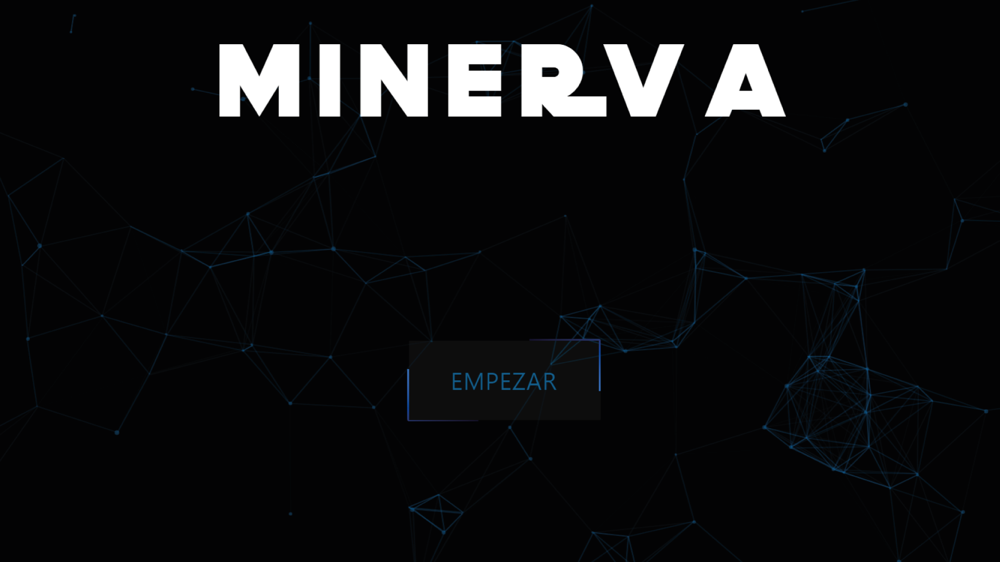

<h1 align="center">
  Welcome to MINERVA app 🚀
</h1>
<p align="center">Minerva is an unfinished project built in react. Its purpose is to carry out a survey in a more intuitive and dynamic way than what is traditionally done
It consists of a multiple intelligences test with a friend named "Minerva" who is really an implementation of Google's Speech Synthesis.
At the end the program will send you a result based on percentages depending on what you have answered.
</p>
<p align="center">
  
<p align="center">
  It is really fascinating what you learn with CSS and the logic that you gain in React by its hooks
</p>

## 🚨 Please read

The code can be a bit messy, when programming I usually go at my own pace and as I progress I order it, sorry if you do not understand well at first what I want to show in the cod

## How to use Minerva APP

1. Install dependencies

   ```sh
   npm i 
   ```

2. Start the development server

   ```sh
   npm start
   ```
3. You can start by adding /inicio in the url

   ```sh
   /inicio
   ```
